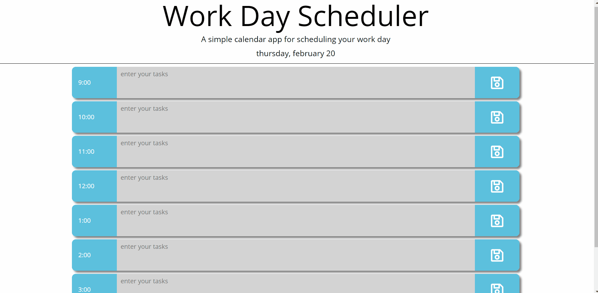

# Workday Planner

## A calendar app to schedule your work day.

## Tools used: 
1. HTML/CSS
2. Javascript/JQuery
3. MomentJS

## User Story: 
### As a productive employee, I would like to: 
1. Be able to schedule my workday by the hour.
2. I would like the schedule to clearly display the time and date.
3. I would like the hour blocks to change based on whether they are in the past, future, or present.

## View deployed app [HERE](https://nich-o-las.github.io/calendar_project/)

